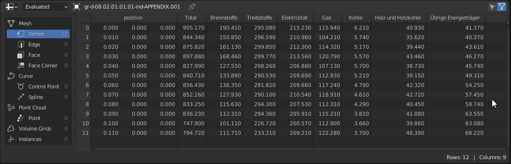
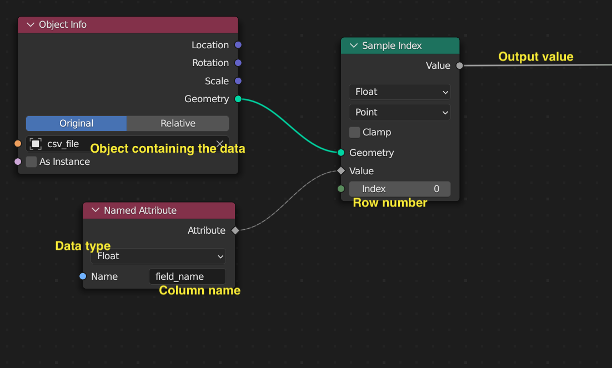
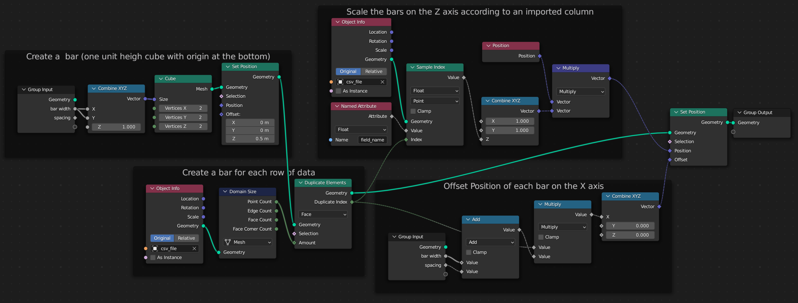
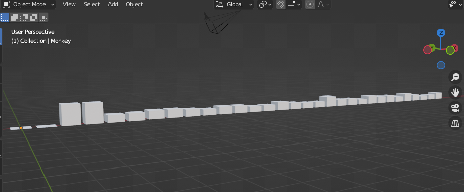
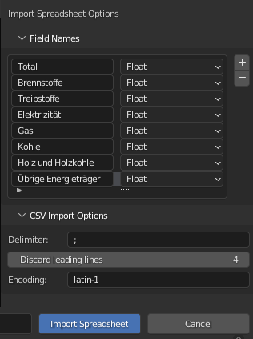
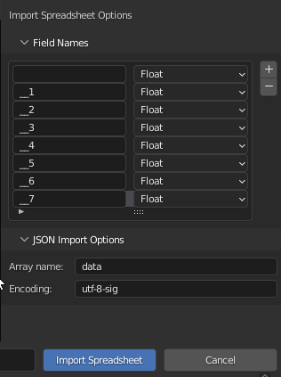
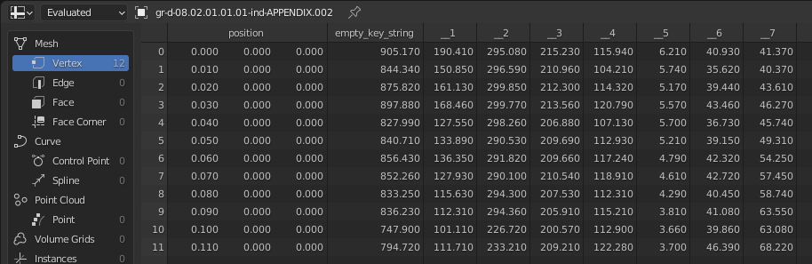

# Blender Spreadsheet Importer

A blender add-on to import CSV or JSON data into blender spreadsheet.  
The data can then be processed with geometry nodes to be visualized.  
For Blender 4.2 and newer, use [Blender Extensions](https://extensions.blender.org/add-ons/spreadsheet-import/) to get this add-on!

## Content
* [Installation](#installation)
* [Usage](#usage)
* [Example Node Setup](#example-node-setup)
* * [Sample a single value](#sample-a-single-value)
* * [Bar Chart](#bar-chart)
* [Example Import Settings](#example-import-settings)
* * [CSV](#sample-csv-import-settings)
* * [JSON](#sample-import-settings-for-json)


## Installation

For Blender 4.2 and newer, please install via [Blender Extensions](https://extensions.blender.org/add-ons/spreadsheet-import/)!

For older Blender Versions:
1. Download the [latest released zip file](https://github.com/simonbroggi/blender_spreadsheet_import/releases/latest/download/blender_spreadsheet_importer.zip)
2. Do **not** unzip the file.
3. Install the file directly in Blender's preferences window: `Edit / Preferences / Install..`

## Usage
1. Open the importer in Blender via `File / Import / Spreadsheet Importer`
2. Use the filebrowser to choose a .csv or .json file
3. Add the field names to be imported by clicking the `+` icon to the right of the list
4. Type in the field names and choose their data types  
    - When importing CSV, the field names must be present in the header row of the csv. The header row is a line that names the columns
    - When importing JSON, the field names must be present in the objects within the data array.
5. When importing JSON, specify the array name where the data is in your JSON File. It must be in the root JSON object, and it must contain an array.
6. When importing CSV, check if the delimiter is correct
7. When importing CSV with lines before the header row, discard these by setting the Discard leading lines value
8. Press the Import Spreadsheet button in the bottom right. The Importer will create a new Object named after the imported file. The Object wil have Mesh Data attached to it called csv_data or json_data depending on the imported file type.
9. Check the Spreadsheet viewer in Blender to see if the data has been imported correctly.  

  

## Example Node Setup

To use the imported data in any geometry nodes tree, add an Object Info node and select the object containing the imported data in the object field.  
  
If later you want to replace the data, you can do this in the object data properties of the selected object: Link another mesh data block to the object, and the values will update. If used column names still exist in the newly linked data block, everything should update as expected.


### Sample a single value

  

### Bar chart
A single float value named "field_name" is used to scale some cubes.  
The Domain Size node is used to find the amounts of bars needed (the size of the imported dataset), and a duplicate of the bar geometry is created for each row of data. The duplicates are then ofset along the X axis according to the duplicate index, and scaled along the Z axis according to the data sampled from the "field_name" comumn where the row matches the duplicate index.  

  

  


## Example import settings

### Sample CSV Import settings

   

Sample CSV Data:  

```
"T 08.02.01.01.01";;;;;;;;
"Endenergieverbrauch nach Energieträger";;;;;;;;
"Tausend Terajoules";;;;;;;;
;;;;;;;;
;"Total";"Brennstoffe";"Treibstoffe";"Elektrizität";"Gas";"Kohle";"Holz und Holzkohle";"Übrige Energieträger"
"2010";"905.17";"190.41";"295.08";"215.23";"115.94";"6.21";"40.93";"41.37"
"2011";"844.34";"150.85";"296.59";"210.96";"104.21";"5.74";"35.62";"40.37"
"2012";"875.82";"161.13";"299.85";"212.3";"114.32";"5.17";"39.44";"43.61"
"2013";"897.88";"168.46";"299.77";"213.56";"120.79";"5.57";"43.46";"46.27"
"2014";"827.99";"127.55";"298.26";"206.88";"107.13";"5.7";"36.73";"45.74"
"2015";"840.71";"133.89";"290.53";"209.69";"112.93";"5.21";"39.15";"49.31"
"2016";"856.43";"136.35";"291.82";"209.66";"117.24";"4.79";"42.32";"54.25"
"2017";"852.26";"127.93";"290.1";"210.54";"118.91";"4.61";"42.72";"57.45"
"2018";"833.25";"115.63";"294.3";"207.53";"112.31";"4.29";"40.45";"58.74"
"2019";"836.23";"112.31";"294.36";"205.91";"115.21";"3.81";"41.08";"63.55"
"2020";"747.9";"101.11";"226.72";"200.57";"112.9";"3.66";"39.86";"63.08"
"2021";"794.72";"111.71";"233.21";"209.21";"122.28";"3.7";"46.39";"68.22"
;;;;;;;;
"Letzte Änderung:  27.07.2022";;;;;;;;
"Quelle: BFE � Gesamtenergiestatistik";;;;;;;;
"� BFS 2022";;;;;;;;
```  

The imported Data viewed in the spreadsheet editor:  

  

### Sample import settings for JSON  

  


Similar JSON Data

```
{
  "data":[
    {
      "T 08.02.01.01.01": 2010,
      "": 905.17,
      "__1": 190.41,
      "__2": 295.08,
      "__3": 215.23,
      "__4": 115.94,
      "__5": 6.21,
      "__6": 40.93,
      "__7": 41.37
    },
    {
      "T 08.02.01.01.01": 2011,
      "": 844.34,
      "__1": 150.85,
      "__2": 296.59,
      "__3": 210.96,
      "__4": 104.21,
      "__5": 5.74,
      "__6": 35.62,
      "__7": 40.37
    },
    {
      "T 08.02.01.01.01": 2012,
      "": 875.82,
      "__1": 161.13,
      "__2": 299.85,
      "__3": 212.3,
      "__4": 114.32,
      "__5": 5.17,
      "__6": 39.44,
      "__7": 43.61
    },
    {
      "T 08.02.01.01.01": 2013,
      "": 897.88,
      "__1": 168.46,
      "__2": 299.77,
      "__3": 213.56,
      "__4": 120.79,
      "__5": 5.57,
      "__6": 43.46,
      "__7": 46.27
    },
    {
      "T 08.02.01.01.01": 2014,
      "": 827.99,
      "__1": 127.55,
      "__2": 298.26,
      "__3": 206.88,
      "__4": 107.13,
      "__5": 5.7,
      "__6": 36.73,
      "__7": 45.74
    },
    {
      "T 08.02.01.01.01": 2015,
      "": 840.71,
      "__1": 133.89,
      "__2": 290.53,
      "__3": 209.69,
      "__4": 112.93,
      "__5": 5.21,
      "__6": 39.15,
      "__7": 49.31
    },
    {
      "T 08.02.01.01.01": 2016,
      "": 856.43,
      "__1": 136.35,
      "__2": 291.82,
      "__3": 209.66,
      "__4": 117.24,
      "__5": 4.79,
      "__6": 42.32,
      "__7": 54.25
    },
    {
      "T 08.02.01.01.01": 2017,
      "": 852.26,
      "__1": 127.93,
      "__2": 290.1,
      "__3": 210.54,
      "__4": 118.91,
      "__5": 4.61,
      "__6": 42.72,
      "__7": 57.45
    },
    {
      "T 08.02.01.01.01": 2018,
      "": 833.25,
      "__1": 115.63,
      "__2": 294.3,
      "__3": 207.53,
      "__4": 112.31,
      "__5": 4.29,
      "__6": 40.45,
      "__7": 58.74
    },
    {
      "T 08.02.01.01.01": 2019,
      "": 836.23,
      "__1": 112.31,
      "__2": 294.36,
      "__3": 205.91,
      "__4": 115.21,
      "__5": 3.81,
      "__6": 41.08,
      "__7": 63.55
    },
    {
      "T 08.02.01.01.01": 2020,
      "": 747.9,
      "__1": 101.11,
      "__2": 226.72,
      "__3": 200.57,
      "__4": 112.9,
      "__5": 3.66,
      "__6": 39.86,
      "__7": 63.08
    },
    {
      "T 08.02.01.01.01": 2021,
      "": 794.72,
      "__1": 111.71,
      "__2": 233.21,
      "__3": 209.21,
      "__4": 122.28,
      "__5": 3.7,
      "__6": 46.39,
      "__7": 68.22
    }
  ]
}
```  

Importing the above JSON file will produce this spreadsheet:  
  

